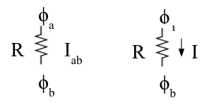
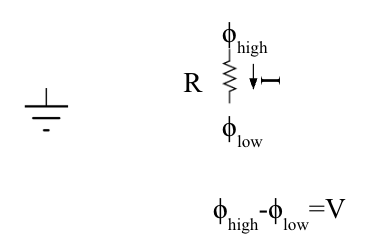
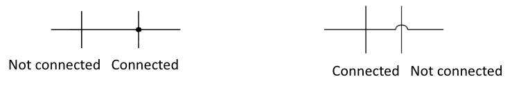
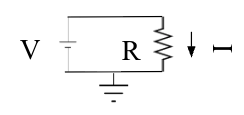
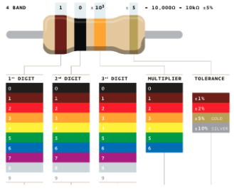
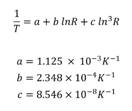
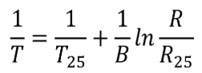
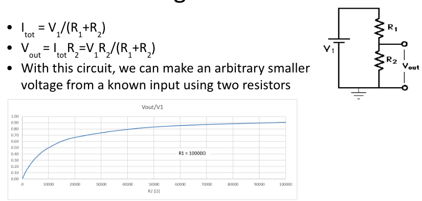

# Day 1 - Intro to Circuits and Electronics

The focus for Day 1 is **getting comfortable with breadboards and basic circuits** so that when the time comes for microcontrollers, nobody fries their device. As a result there won't be any code documents for references.

## Resistor Networks
- **Current(I in Amperes A)**: movement of positive charges (the motion of electrons is the opposite of current)
    - flows from a point of high electrical potential energy (V) ti a lower point of electrical potential energy
    - if we traverse from a higher (A) to lower (B) point, then I(AB) is positive
    - 
- Amount of current flowing is 
    - proportional to difference in potential difference between 2 points (**Voltage(V in Volts V)**) 
    - inversely proportional to electrical resistance between 2 points (**Resistance(R in Ohms Ω)**)
    - known as **Ohm's Law**: V=IR
- Energy transmitted per second (**Power(P in Watts W)**) P = VI = (I^2)R
- Voltage is only meaningful when comparing two points, so often a reference potential is assigned (set to 0V) when solving for all the relative values
    - this is known as **Ground**
    - 
- **Kirchoff's Current Law (KCL)**: as current flows and meets at branch points, the sum of current entering the branch point must equal the sum of current exiting the branch point
    - parallel (components with the same start / end nodes) elements have the same voltage across them
    - series (components where one's end node connects w/ the other's start) elements have the same current across them
- **Kirchoff's Voltage Law (KVL)**: the total voltage rise from sources must be equal to the total voltage drop across components in any closed loop
    - 
    - *(Image via [Electronic Specifier](https://www.electronicspecifier.com/studentzone/student-blog/the-importance-of-kirchhoffs-laws-in-electrical-engineering/))*

All of these conventions can be used to complete basic circuit analysis (Finding V,I,R values at different points)

## Circuit Diagrams
- Wires are electrical connections with zero resistance and are drawn as intersecting lines
    - there exists multiple conventions
    - 
- constant voltage sources in circuit diagrams provide voltage in a circuit
    - the wider end is the positive side
    - 

## Components in the Real World
- Often to prototype designs and experiment with how components behave, breadboards are used to prototype designs
- DMMs / Digital Multimeters are used to measure the difference between two probs (potential difference, resistance, current flowing)
- Resistor values can be printed on the surface as numbers or color bands which give tolerance, power, and resistance
    - 

To gain a better understanding of breadboards and real world components its recommend you experiment with these components, measuring resistance, capacitance etc. as you orient resistors on a breadboard.

## Useful Components / Circuits
- **Thermistor**: temperature dependent resistor, resistance changes with temperature
    - temperature can be derived from resistance using The Steinhart-Hart equation
    - there are multiple variations of equations (top: uses 3 predefined constants, bottom: uses 1 constant and relative temp at 25C)
    - 
    - 
- **Voltage Divider**: circuit used to change voltage based on ratio of resistors
    - can be used to create a preferred Vout
    - can be used to determine a variable resistance if Vout is known / measured
    - 

Imagine how these components can be used in combination to determine temperature at a given time.

## Additional Reading
- NOTES: [UIUC ECE205: Circuit Analysis Notes](https://courses.physics.illinois.edu/ece205/sp2021/notes/Lecture5-6.pdf)
- NOTES: [The Organic Chemistry Tutor - KVL, KCL, and Ohm's Law](https://www.youtube.com/watch?v=2Zu3ppq3n8I)
- PRACTICE: [autoCircuits](https://autocircuits.org/autocir_home.html) for problems + [CircuitSteps](https://circuitsteps.com/) for solutions
- PRACTICE: [Tinkercard Breadboard Sim](https://www.tinkercad.com/circuits)
- NOTES: [Honeywell - Thermistors](https://automation.honeywell.com/us/en/products/sensing-solutions/sensors/temperature-and-humidity-sensors/thermistors)
- NOTES: [Sparkfun - Voltage Dividers](https://learn.sparkfun.com/tutorials/voltage-dividers/all)

**[Continue to next lesson](../D2:Intro%20To%20Arduino%20IDE/D2.md)**