# Day 2 - Intro to Arduino IDE

The focus for Day 2 is **learning about the microcontrollers through the Arduino Uno**, while also practicing programming fundamentals. While reading this document try and explore the Arduino IDE and view the examples given.

## What is a microcontroller?
- **microcontroller**: compact single-chip device used in embedded systems with real-time single-threaded operation, which allows for predictable behavior and real-time computing
    - there are many microcontrollers on the market, we will be using the ATMega 328
    - 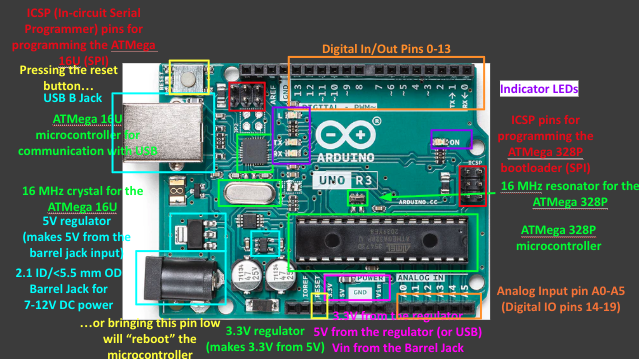
- to compile and upload software you can run a C compiler and manually activate the compiled binary file or use a high level IDE
    - for the sake of simplicity we will be using the [Arduino IDE](https://www.arduino.cc/en/software)
        - follow the installation instructions to setup the IDE on your device
        - if you find your current python version does not work with the examples try editing your `Path` variable in environment variables to an updated version

## Digital I/O
- the Arduino IDE has many built in examples to play around with, lets check out Blink! (File/Examples/(Built-in examples) 01.Basics/Blink)
    - to connect your Arduino 
        1. use the USB cable and connect the microcontroller to your computer
        2. look under Tools/Board and select Arduino Uno then Tools/Port and select the USB port used to connect
        3. use the leftmost arrow to compile your code and the 2nd leftmost arrow to upload
- GPIO digital pins can act as digital input / output (can drive a load or measure a value)
    - need to set the `pinMode` to do so, which can be `INPUT`(Reading) or `OUTPUT`(Writing)
- `delay` and `delayMicroseconds` are functions that idle the microcontroller for a given time (respectively millis and micro seconds)

```cpp
// LED_BUILTIN is a constant, can replace with int representing GPIO pin
void setup(){ // setup runs once for things like pin modes or baud rates
    pinMode(LED_BUILTIN, OUTPUT); // make the default LED pin output from the microcontroller
}

void loop(){ // loop runs over and over
    digitalWrite(LED_BUILTIN, HIGH); // set digital signal to high / 1
    delay(1000);                     // pause further instructions for a second
    digitalWrite(LED_BUILTIN, LOW);  // set digital signal to low / 0
    delay(1000);
}
```

## Diodes and Logic
- **Diodes**: circuit elements only conduct current in one direction, voltage across diode needs to exceed a threshold before conducting
    - always place a current limiting resistor **in series** with the LED, as otherwise resistance between GND and Voltage source will be infinite
    - 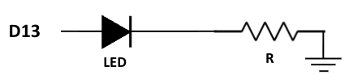
    - 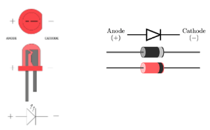
- besides delay, there are other time based functions that do not pause the program
    - `millis()` returns num of milliseconds since sketch started, `micros()` retyrbs num of microseconds since sketch started
- Logic statements can be used to conditionally execute code
    - logical expressions output boolean values (true/false) that determine whether code is executed
    - common statements include
        - `==` equal
        - `!` not
        - `&&` and
        - `||` or
    - these can be combined with operators to combine values, 0 is false and any other numerical value is true
        - `%` modulo, returns remainder of division
        -  `+`, `-`, `*`, `/` commond arithmetic expressions
    - 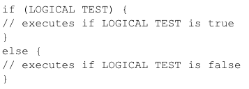
### Practice
1) Custom Blink
    1) ([ANSWER](./Answers/1-Blink/Blink1.1.ino)) Try and customize blink to make the on and off days uneven
    2) ([ANSWER](./Answers/1-Blink/Blink1.2.ino)) Connect two LEDs and try and blink each of them with current limiting resistors
    3) ([ANSWER](./Answers/1-Blink/Blink1.3.ino)) Develop a more sophisticated blink with modulo

## Switches and Buttons
- **Switch**: component that enables the passage of current
    - connect wire to pin A and another to pin B, pin A reads values pin B outputs the value of !A, plug the wire in and out of GND to see how it functions
        - currently when the wire is not plugged in the value is floating and electric fields felt by the wire influence the output
    - 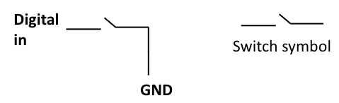
    - **Pull-Up(resistor to high, img below)** and **Pull-Down(resistor to low)** resistors are used to prevent this floating value when a switch is open
        - observe how the circuit acts with a pullup resistor
        - 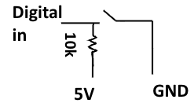
        - arduino has built-in pull up resistors, which can be set with `pinMode(pin, INPUT_PULLUP)`
- **Push Buttons**: act similarly to switches, but need to be continuously pressed to be in a closed state
    - 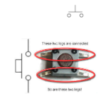

**NOTE:** Never connect a pullup / pulldown without a resistor otherwise you will be connecting your voltage source directly to GND, creating infinite current and shorting it
### Practice
2) ([ANSWER](./Answers/2-Logical_Buttons/LogicalButtons.ino))Logical Buttons
    - Wire an LED + resistor to a third digital pin and GND, and configure this pin as an OUTPUT
        - Write a program that lights the LED if button1 AND button2 are pressed
        - Write a program that lights the LED if button1 OR button2 are pressed
        - Write a program that lights the LED if NEITHER button1 NOR button2 are pressed
        - Write a program that lights the LED if button1 is pressed AND button2 is NOT pressed


## Variables
- Variables can be used to store values, they can be local or global controlling their scope of access
- Variables can be different types, controlling how much memory they require
    - `byte`: 8 bits(value of 0 or 1) allowing a range of (0-2^8 - 1) aka 0-255
    - **base / radix** describes the total number of unique digits, impacting how numbers are represented
        - base 10 / decimal is what we are used to
        - base 2 / binary reads values in powers of 2
        - base 16 / hexadecimal which uses A,B,C,D,E,F for values 10-15
    - when a number exceeds the max possible storage it overflows and the information is lost
    - to represent negatives, the effective maximum is halved, as the most significant bit is considered negative
    - 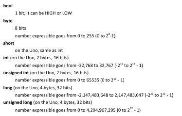
    - in general number types can differ based on the microcontroller as they move different sizes of data (the ATMega328 moves 16 bits at a time)
    - 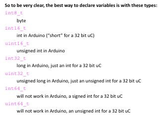

## Arrays and For Loops
- **loops** are used to repeat segments of code, just like the `loop()` function in the arduino file
    - while loops run as long as the condition remains true
        - 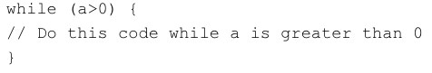
    - for loops allow code to be repeated for a given amount of times
        - 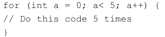
- **arrays** are used to hold a series of items, to initialize the size must be known at run time
    - to access each value, index them from left to right starting from position 0 to length - 1
        - 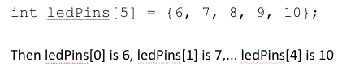
### Practice
3) ([ANSWER](./Answers/3-Array_Traversal/ArrayTraversal.ino))Array Traversal - wire up 5 leds and write a program to set all of these values on and off in sequence

## Additional Reading
- NOTES: [Arduino Setup()](https://docs.arduino.cc/language-reference/en/structure/sketch/setup/) + [Arduino Loop()](https://docs.arduino.cc/language-reference/en/structure/sketch/loop/)
- NOTES: [Sparkfun - Button and Switch Basics](https://learn.sparkfun.com/tutorials/button-and-switch-basics/all)
- NOTES: [GeeksforGeeks - Base Conversions](https://www.geeksforgeeks.org/digital-logic/number-system-and-base-conversions/)
- PRACTICE: [Emory Math Center - Exercises - Basis](https://mathcenter.oxford.emory.edu/site/cs170/probSetBases/)
- NOTES: [GeeksforGeeks - Arithmetic Addition in Binary Number System](https://www.geeksforgeeks.org/computer-organization-architecture/overflow-in-arithmetic-addition-in-binary-number-system/)
- NOTES: [W3 Schools - C++ Arrays and Loops](https://www.w3schools.com/cpp/cpp_arrays_loop.asp)

**[Continue to next lesson](../D3:Arduino%20Serial%20and%20Analog%20In;%20Functions/D3.md)**