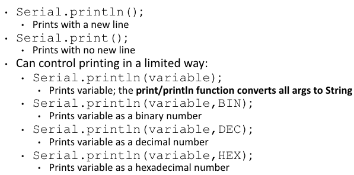
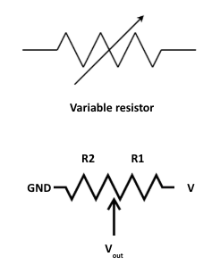

# Day 3 - Arduino Serial and Analog In; Functions

The focus for Day 3 is getting comfortable with **serial communication and analog values**, while also learning about more ways to write clean code.

## Serial Communication
- Arduino has a built in **serial communication function** which can be used to transfer information and view real time data
    - always start by setting the **baud rate**(data transmission speed)
        - `Serial.begin(bitspersecond)`
    - this can be viewed by going to Tools > **Serial Monitor**, and setting the read value to match the same bitspersecond
    - there are many ways to **output to serial monitor**
        - 
- the **Serial Plotter** can be used to view the behavior of serial outputs overtime
    - every value separated by a `" "` is a new line of values
    - observe the following code through the serial plotter
```cpp
float x = 0;
void loop(){
    Serial.println(String(sin(x)) + " " + String(cos(x))); //displays a sin and cos over time
    x += 0.02;
}
```

## Strings
- **Strings** are a type used to represent text or sequences of characters, and are defined like so `string var = "words here"`
    - to create strings using variables of other types, `String(arg)` converts the argument into a string type
        - `Serial.println("Value of var is " + String(var) + ".")`
### Practice
1) Button Count
    1) ([ANSWER](./Answers/1-Button_Count/ButtonCount1.1.ino))Write a program so that when a button is pressed a statement is printed to serial monitor
    2) ([ANSWER](./Answers/1-Button_Count/ButtonCount1.2.ino))Write a program that outputs to serial how many times a button has been pressed

## Serial I/O
- values can be read from serial monitor via `Serial.read()`
```cpp
// example with single byte read
loop(){
    if(Serial.available() > 0){ //check if there exists an input
        int num = Serial.parseInt() //reads string and converts to int until char appears, can also use parseFloat()
        char inputchar = Serial.read(); //reads one byte at a time
    }
}
```
```cpp
// example with read until enter
loop(){
    if(Serial.available() > 0){ //check if there exists an input
        String inputString = Serial.readStringUntil('\n');
    }
}
```
### Practice
1) ([ANSWER](./Answers/2-Serial/SerialInput.ino))Serial Input - Write a program that will turn an LED on if you type "ON" and off if you type "OFF"
2) ([ANSWER](./Answers/2-Serial/InputPeriod.ino))Input Period - Write a program that allows you to input two numbers
 `"number1 number2"` that set the blinking period of 2 LEDs
    - when taking in a string with ints and chars, you need to consider how to handle the characters

## Analog Values
- compared to the past **digital signals** which can be high/low, an **analog signal** can have a range of values
    - computers + microcontrollers attempt to approximate this value through an **ADC / Analog to Digital Converter**
    - an analog signal has a min and max, and divides this rnage into bins, finding the bin that matches this voltage the most, this is done via `analogRead(pin)`
    - number of bins = total combination of numbers bits can represent
    - uncertainty = 1/2 of a bin width
        - Vin = (Number + 0.5) * 5/(2^n)
        - let n = number of bits in an ADC
    - the number of pins with an ADC are limited (only those with ~ marking and Analog pins)
- **Potentiometer**: 3 terminal device with a variable Resistor 1 and 2 that output a variable voltage
    - 
    - observe the behavior of a potentiometer through viewing analogRead in the serial plotter
- **photocell / photoresistor**: a resistor that changes reisstance based on how much light it gets
    - variable resistors like photocells and thermistors can be used in combination with ADCs and voltage dividers to measure information
### Practice
1) Write a program for a voltage divider with one known resistance and one thermistor
    1) ([ANSWER](./Answers/3-Analog_VoltageDiv/GetVoltage.ino))make the program return the actual voltage value that is read
    2) ([ANSWER](./Answers/3-Analog_VoltageDiv/GetTemp.ino))convert this voltage value into the temperature in celcius
    3) ([ANSWER](./Answers/3-Analog_VoltageDiv/TempToLED.ino))Make a program that lights an LED if the temperature measured exceeds 26C

## Functions
- **functions** allow code to be reused for varying inputs, reducing the code bloat and making information easier to read
    - try repackaging your code from earlier into functions
```cpp
//function definition
returnType functionName(inputType inputName){
    returnType value = inputName * 2;
    return value;
}

// function call
inputType a = value;
Serial.println(functionName(a)); // prints value*2
```
## Additional Reading
- NOTES: [Arduino Serial.write()](https://docs.arduino.cc/language-reference/en/functions/communication/serial/write/)
- NOTES: [Keysight - Commercial ADCs](https://www.keysight.com/used/us/en/knowledge/glossary/oscilloscopes/what-is-an-analog-to-digital-converter)
- NOTES: [W3Schools - C++ Functions](https://www.w3schools.com/cpp/cpp_functions.asp)

**[Continue to next lesson](../D4:Processing/D4.md)**