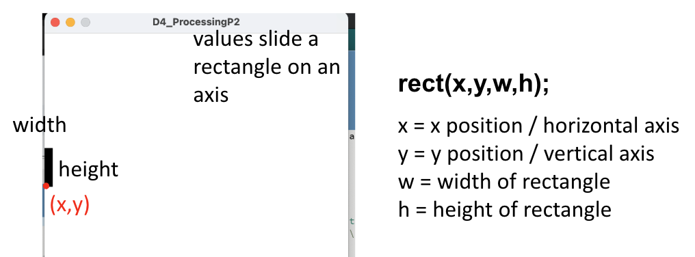

# Day 4 - Processing

The focus for Day 4 is to **understand Processing** and how it can be used to exchange and interpret data.

## Serial Communication
- microcontrollers can interface with devices using **serial communication**, similar to how sketches are uploaded from computer to. arduino
    - **processing** is one of many programs that can interface, which is similar to the Arduino IDE and allows graphics + live data plotting
    - setup processing with this [link](https://processing.org/download)
- look into the [processing documentation](https://processing.org/reference) to explore how to take in values
    - `setup()` and `draw()` work similarly to `setup()` and `loop()` in arduino, but draw is typically reserved for writing changes to graphics
    - `serialEvent(Serial port)` is used to read from the serial monitor and is updated anytime data is sent over with `port.readStringUntil()`
### Practice
1) ([ANSWER](./Answers/1-Brightness/))Brightness - Print the output of a potentiometer to serial, then connect the port to processing and use this value to change brightness

NOTE: Serial Monitor is only able to output at one destination, so if Serial Monitor / Plotter is open a "Port busy" error will occur

## Drawing Shapes
- processing provides a library of functions, one of such creates 2D primitives
    - [rect()](https://processing.org/reference/rect_.html) draws a rectangle to the screen
    - 
### Practice
1. ([ANSWER](./Answers/2-Rectangle/))Rectangle - Play around with parameters and see how they impact the drawn rectangle, make a rectangle move as the potentiometer moves

## Plotting Data with History
- when drawing, we need to store values to be able to plot them with history
    - to do so we need to plot our data on a range
    - consider the function **point** which draws a dot in a given x,y position 
### Practice
1. Multiple Values - plot the output of values in a line and reset the plotting once the screen is filled
    1. ([ANSWER](./Answers/3-History/MultipleValues1.1.ino)) Do so by resetting count
    2. ([ANSWER](./Answers/3-History/MultipleValues1.2.ino)) Do so using modulo
2. History - implement the changes with history such that the screen scrolls as new data is input
    1. ([ANSWER](./Answers/3-History/History2.1.ino)) Using an array
    2. ([ANSWER](./Answers/3-History/History2.2.ino)) Using a ring buffer

## Parsing Multiple Lines
- we use string parsing when we want to take in multiple values from serial monitor
    - arduino - print out values with a defined separating character
    - processing - split input using defined separating character with the `split()` function [here](https://processing.org/reference/split_.html)
### Practice
1. ([ANSWER](./Answers/3-History/MultipleInputs.ino)) Multiple Inputs - Read in two values from 2 potentiometers or a joystick and plot them simultaneously

## More Details
- processing has a lot of functions that support the generation of graphics, including
    - [text()](https://processing.org/reference/text_.html) for loading fonts and writing text on the screen
    - [mouseX](https://processing.org/reference/mouseX.html) and [mouseY](https://processing.org/reference/mouseY.html) are system variables that allow the user to make references to choices in the processing window
        - combined with [mousePressed()](https://processing.org/reference/mousePressed_.html) can create buttons for controls
        - the **ControlP5** library must be used to enable this

## Additional Reading
- NOTES: [Processing Documentation](https://processing.org/reference/)
- PRACTICE: [Arduino - Visualization with Arduino and Processing](https://www.arduino.cc/education/visualization-with-arduino-and-processing/)
- NOTES: [Sparkfun - Connecting Arduino to processing](https://learn.sparkfun.com/tutorials/connecting-arduino-to-processing/all)
- NOTES: [Arduino - Handshaking](https://docs.arduino.cc/built-in-examples/communication/SerialCallResponse/)
- NOTES: [Importing Libraries in Processing](https://processing.org/reference/import.html)

**[Continue to next lesson](../D5:Pong%20-%20PROJECT/D5.md)**