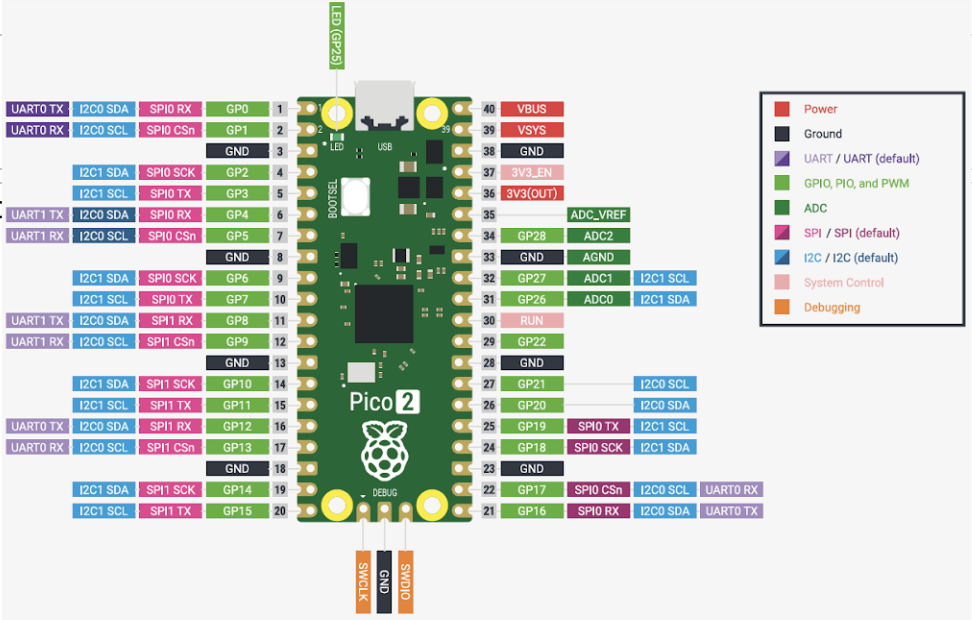

# Day 10 - RP2350

The focus for Day 10 is to **explore how to adjust to different microcontrollers** through learning how to interface with the RP2350.

## RP2350 + Setup in Arduino IDE
- the RP2350 comes from the Raspberry Pi Foundation which is know for its single board comouters
- Some features of the RP2350 include:
    - 32 bit ints
    - Dual core (can run 2 programs)
    - Built in WiFi and Bluetooth
    - Clock speed of 150 MHz
    - 520kB RAM
    - 30 GPIO Pins (4 for analog, 12 bit ADC)
    - 2x UART + USB Serial
    - 2x SPI controllers
    - 2x I2C controllers
    - 24x PWM channels
    - 12 x PIO State machines
    - **uses 3.3V Power not 5V**
- microcontrollers besides the Arduino are **able to be ported over to work** with the Arduino IDE, the the Arduino code is translated to the other microcontrollers' code
    1) add the board manager following [this tutorial](https://arduino-pico.readthedocs.io/en/latest/install.html#installing-via-arduino-boards-manager)
    2) after restarting the IDE, install the Earle Philhower manager
    3) restart the Arduino IDE
    4) Plug into computer and select under board the Raspberry Pi Pico 2
    5) Port with have an entry "UF2 Board", select and load Blink to run
    6) Check port again and check if it aligns with current board
    - if issues ever occur, unplug the board, hold down BOOTSEL while plugging the board then upload to UF2 once more
    - 
- Useful docs to reference when programming:
    - [Raspberry Pi Pico - Official Software Development Kit (SDK)](https://datasheets.raspberrypi.com/pico/getting-started-with-pico.pdf)
    - [docs for Arduino port of Pico SDK](https://arduino-pico.readthedocs.io/en/latest/)

## RP2350 vs Arduino Uno
- if we try and use the program from [Day 9](../D9:SPI/Answers/1-SPI/GetAccel.ino), the code will not function properly due to the change 
    - Need to be careful in the Arduino IDE because the reference pages are for Arduino and may not apply to RP2350
    - replace the typical int with `int16_t xAccelInt = (xHigh << 8) + xLow;`
    - digital I/O still works the same
- when observing the ADC through the arduino IDE, the resolution is surprisingly the same as arduino despite having more bits > we need to set this
    - `analogReadResolution(12);`
- as the pico has multiple SPI pins, we are able to **specify which one to use**, and we can also specify which SPI channel
    - calling `SPI.begin()` without specifying the pins will result in the default pins being used (Dark Pink in GPIO Pinout)
```cpp
#include <SPI.h>

  int MOSIpin = 19; 
  int CLKpin = 18; 
  int CSpin = 17; 
  int MISOpin = 16; 

SPISettings spisettings(1000000, MSBFIRST, SPI_MODE0);

void setup() {
  Serial.begin(115200);

  SPI.beginTransaction(spisettings);
  SPI.endTransaction();

  pinMode(CSpin, OUTPUT);
  SPI.setRX(MISOpin);
  SPI.setTX(MOSIpin);
  SPI.setSCK(CLKpin);


  SPI.begin();  // initialize SPI:
```
- input this code into the updated [Day 9 Code](../D9:SPI/Answers/1-SPI/GetAccel.ino) to check that it is functional

## Display Functionality with OLED
- we can read and write data to OLED displays
- install the Adafruit GFX and [Adafruit SSD1306](https://github.com/adafruit/Adafruit_SSD1306) libraries
    - after restarting the IDE observe the example from [Custom Libraries/ssd1306_128x32_i2c](https://github.com/adafruit/Adafruit_SSD1306/tree/master/examples/ssd1306_128x32_i2c)
    - add `Wire.setSDA(16);` and `Wire.setSCL(17);` in setup and wire up the OLED to observe its behavior
### Practice
1) ([ANSWER](./Answers/DisplayAccel.ino)) OLED Accelerometer - revisit the old accelerometer program and adjust it such that the contents are printing live on the OLED Display

## Additional Reading
- NOTES: [Jeff Geerling - Raspberry Pi Pico 2](https://www.jeffgeerling.com/blog/2024/raspberry-pi-pico-2-rp2350-adds-more-pio-risc-v-cores/)
- NOTES: [Instructables - Programming RASPBERRY PI PICO with Arduino IDE](https://www.instructables.com/Programming-RASPBERRY-PI-PICO-With-ARDUINO-IDE-How/)
- PRACTICE: [Instructables - 15 Cool OLED Display Projects](https://www.instructables.com/15-Cool-OLED-Display-Projects/)

**[Return to week 2 main](../WEEK2.md)**