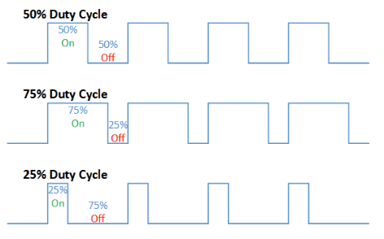
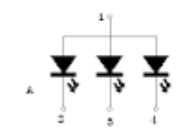
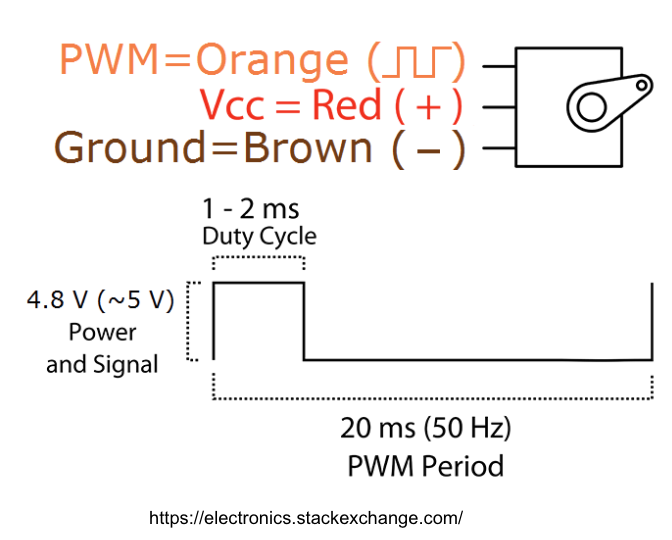
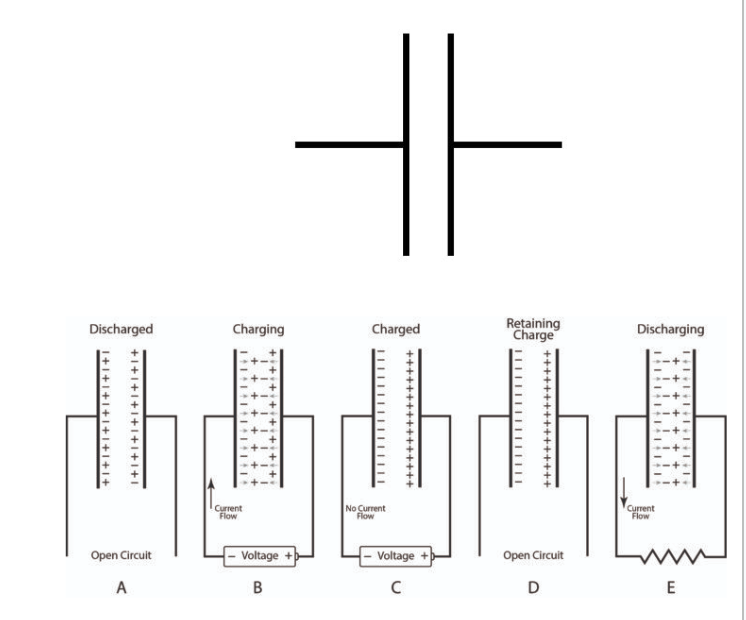
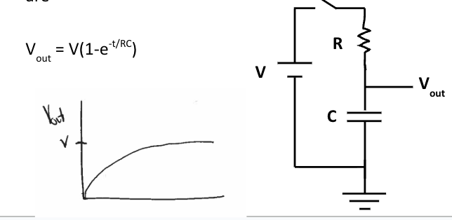
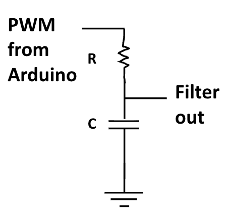

# Day 6 - PWM Filtering

The focus for Day 6 is to **explore analog output through pulse width modulation** and how this can be used to control servo motors.

## Analog Outputs
- the ATMega328 is unable to prodice a true arbitrary analog voltage level and instead uses a **periodic digital output** with different segments of high and low
    - **duty cycle**: the percentage of time it is high
    - time average is voltage equal to `duty cycle x max voltage`
    - 
- these varying digital signals are made through **PWM(Pulse Width Modulation)**
    - made in a 488Hz square wave with programmable duty cycle
    - `analogWrite(pin, value)`
        - value must be out of 255 (ex: 255/255 = 100% duty cycle)
        - only possible on pins marked with `~`, indicating it can complete PWM (3,5,6,9,10,11)
- when an LED rapidly blinks, our eyes create a smooth transition as they can't register the frame rate
    - through PWM we can adjust the brightness of an LED
    - observe the common anode RGB LED ()
        - remember that current flows from high to low, so if any of the pins 2,3, or 4 were greater than or equal to the source (1), current wouldn't pass
        - REMEMBER TO ADD A CURRENT LIMITING RESISTOR
### Practice
1) ([ANSWER](./Answers/1-AnalogOutput/RGB.ino)) Nested RGB - Connect the RGB pins + current limiting resistors to PWM pins and write a program to that loops through Red, Green, and Blue colors in nested loops so all color combos are visited
2) ([ANSWER](./Answers/1-AnalogOutput/Temp_RGB.ino)) Temp Indicator - Make a program that controls the color of the RGB LED depending on the temperature of the thermistor using your function from earlier (blue=(<23C), green=(23-25C), red=(>25C))
3) ([ANSWER](./Answers/1-AnalogOutput/RGBSliders.pde)) RGB Slider - Make a program in Processing with 3 sliders 0-255 for RGB; send the values of these sliders over Serial to the Arduino to control the RGB LED color via your computer

## Servos
- **Servo**: devices that rotate a specific angle response to a PWM signal on its input (not full 0-100, regardless of angle DC is 1-2ms only)
    - 
    - Arduino has a [servo library](https://docs.arduino.cc/libraries/servo/) that makes these actions easier
### Practice
1) ([ANSWER](./Answers/2-Servos/ServoMovement.ino)) Servo Movement - Make a program that rotates the Servo motor. The amount the servo rotates is given through an input through Serial Monitor
    - when the input is negative make it rotate the opposite direction

## True Analog Signal Generation
- to produce a truly varying analog voltage, a specific circuit is needed
    - **capacitor**: pair of metal conductors that store charge
        - 
        - Q (charge) = C (capacitance) V (potential difference)
        - when fully charged a capacitor does not allow the passage of current
    - an **RC Circuit** charges and discharges a capacitor using a resistor to create a smooth transition
        - 
        - this discharge is also curved, allowing a smoother transition based on the R and C values
    - **Low Pass Filter** can be used to achieve the above with an RC circuit
        - 

## Additional Reading
- NOTES: [Common Anode RGB LED Docs](https://www.adafruit.com/product/159)
- NOTES: [Sparkfun - Pulse Width Modulation](https://www.adafruit.com/product/159)
- NOTES: [Arduino Servo.h Docs](https://docs.arduino.cc/libraries/servo/)
- PRACTICE: [Servo Example Projects](https://docs.arduino.cc/learn/electronics/servo-motors/)

**[Continue to next lesson](../D7:Motors/D7.md)**