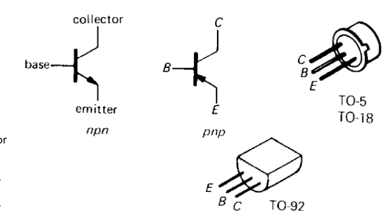
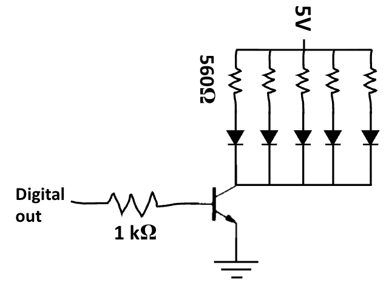
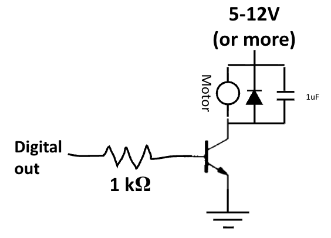
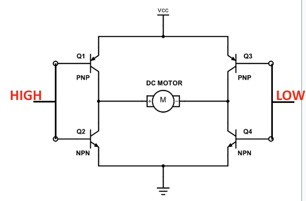
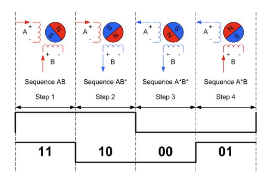
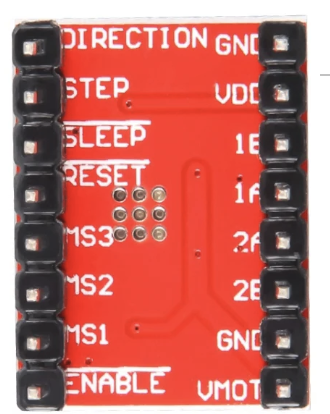
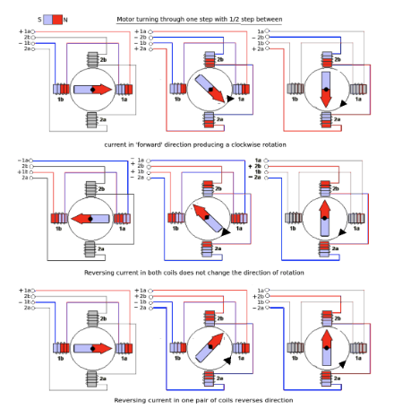
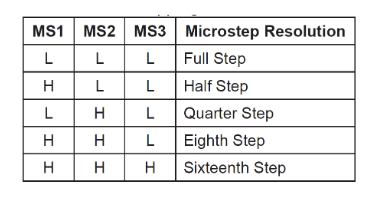

# Day 7 - Motors

The focus for Day X is to **learn how to interface with devices with large current requirements** through the use of motors.

## Transistors
- the arduino reference often lists a maximum 20 mA output from a pin, so if combinining all pins the maximum total currrent would be around 200 mA
    - if an element requires more power, we can't run it from out pin, so we use **transistors**
- **transistors**: circuit element that allows a small signal to control a large power output
    - Bipolar Junction Transistor (BJT)
    - Metal-Oxide Semiconductor Field Effect Transistor (MOSFET)
- Bipolar Junction Transistor: shows a base-emitter connection and collector-emitter connection that behaves like diodes
    - 
    - **npn**: current flows from base->emitter, collector->emitter
    - **pnp**: current flows from emitter->base, emitter->collecto
    - since connection can act like a **diode**, you need to add a current limiting resistor when using
    - there is a BJT param known as the **beta/ h(FE)** which is the **gain**, the current at emitter = beta * current from base to emitter
        - if the resistance is relatively large, the max voltage is limited
        - 
        - observe how transistors can support higher current load by modeling the above circuit
- arduino also allows one to input external voltage sources through the power jack, creating a voltage rail at Vin

## Motors
- a DC motor turns when voltage is applied at its terminals
    - large motors need more current, we can power this using a transistor to control ground so our 5V and higher power rail don't touch
    - 

## H-Bridge
- inorder to change directions one would have to apply negative voltage or switch wires which is inconvenient
- the **H-Bridge** can be used to reverse the direction by changing the voltage at two terminal points
    - 
    - this is a common circuit that is available in many IC (Integrated Circuit) packages

## Stepper Motors and Drivers
- Stepper motors are motors with a set of electromagnets inside that allow more control over the angle of a rotor
    - by setting values high and low, the direction of the magnets changes, shifting the position of the motor
    - by adjusting the order, the direction turned can adjust from clockwise to counter-clockwise
    - 
- as setting up the H Bridge is tedious, we can use an IC stepper driver (A4988) to handle this
    - 
    - drivers support microstepping, through PWM and intermediate positions
        - 
    - this is how it is done for the A4988 specifically, by setting the signals of each of the MS values, the accuracy of steps appear
        - 
    - to setup the stepper driver
        - connect !SLEEP and !RESET
        - connect 1A and 1B to Green and Black wires
        - connect 2A and 2B to Red and Blue wires
        - connect GNDs to Arduino GND
        - connect VMOT to Vin
        - connect VDD to 5V
        - connect !ENABLE to a digital pin
        - connect DIR to a digital pin
        - connect STEP to a digital pin
### Practice
1) Learn Motors
    1) Setup !ENABLE and DIR to LOW then set step HIGH and LOW with a 1ms delay after each, do this for 100 steps then do the same with DIR to HIGH, then !ENABLE to HIGH
    2) Try and determine empirically how many steps a full 360 degree rotation takes, do the same but set MS1 to HIGH
2) ([ANSWER](./Answers/1-StepperMotors/StepperInput.ino)) Stepper Input - Write a program with a function that turns the motor an input number of steps. Steps can be + or - (clockwise or counterclockwise). Add a function that turns the motor an input number of degrees. Degrees can be + or -

## Additional Reading
- NOTES: [Sparkfun - Transistors](https://learn.sparkfun.com/tutorials/transistors/all)
- NOTES: [Modular Circuits - H Bridge](https://www.modularcircuits.com/blog/articles/h-bridge-secrets/h-bridges-the-basics/)
- NOTES: [Digikey - How to Drive a Stepper Motor](https://forum.digikey.com/t/how-to-drive-a-stepper-motor/13412)

**[Continue to next lesson](../D8:Pinball%20-%20PROJECT/D8.md)**