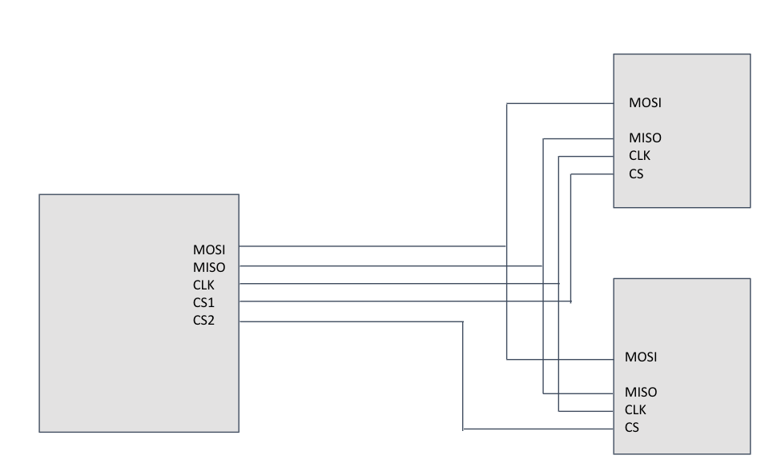
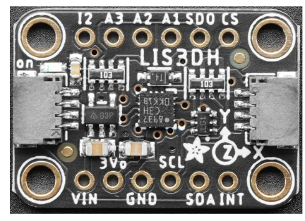
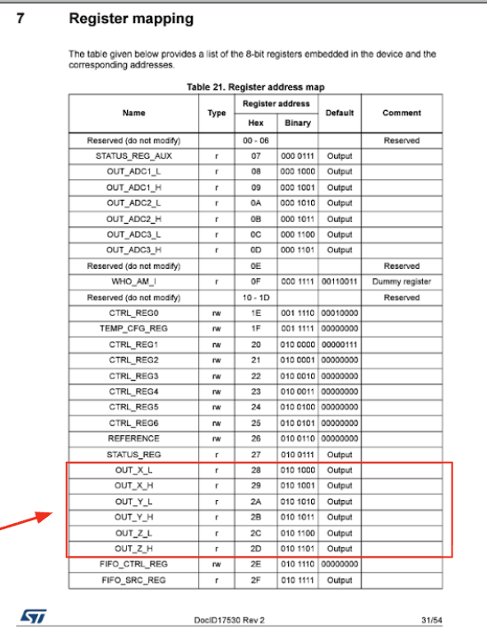
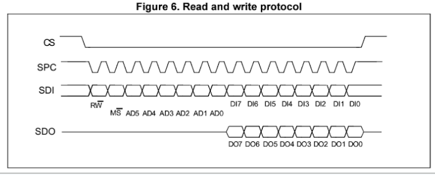
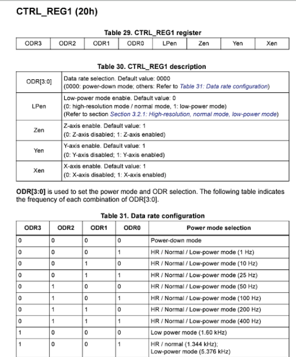
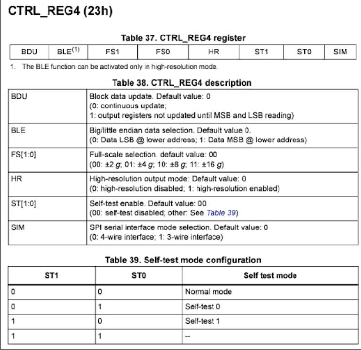
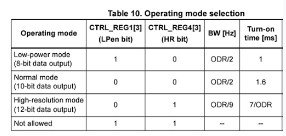

# Day 9 - SPI

The focus for Day 9 is to **introduce communication protocols to understand how data is transferred between devices** through SPI (Serial Peripheral Interface).

## SPI Setup
- **SPI / Serial Peripheral Interface** is a way to communicate digitally with devices with shared data lines
    - 
    - devices know they are being talked to when their `CS is LOW`
    - data is sent into the microcontroller from `MI (Master In)`
    - data is sent from the microcontroller from `MO (Master Out)`
    - communication is synchronized by the `CLK` line
    - multiple devices can be connected to the same MO (Master Out) and MI (Master In) lines, as they each have their own CS that will activate separately
    - data transfer is **full duplex**: can send and receive simultaneously
- devices may have many functions that can be controlled and different information whiich are stored in different memory locations (**registers**)
- SPI process
    1) Device is selected by bringing its `chip select line low`
    2) `Clock then starts`, and data sent from master to device (MO) and vice versa (MI) is synchronized to the clock
    3) Master sends data to the device 
    4) `A register address, a command (read or write), and some data (if it is writing)`
    5) The size of this data depends on the device and this is given in the spec sheet of the device you’re communicating with
- to setup SPI on Uno, [a library exists](https://docs.arduino.cc/language-reference/en/functions/communication/SPI/) which limits which GPIO pins you use
    - **MOSI (Master Out Slave In)** -> digital 11
    - **MISO (Master In Slave Out)** -> digital 12
    - **SCK (Serial Clock)** -> digital 13
    - **CS (Chip Select)** -> digital 10 but doesn't matter

## SPI with LIS3DH
- 
- the LIS3DH is a 3 axis accelerometer that can communicate in I2C or SPI, to connect with SPI, attach the following
    - SCL = SCK
    - SDA = MOSI
    - SDO = MISO
    - CS = CS
- Observe the components data sheet to determine which registers we want to obtain for X, Y, and Z accel
    - 
- How the SPI transfer works
    - CS set to low, showing these devices are communicating,
    - R!W: (1 = reading, 0 = writing) is sent to register
    - M!S: (1 = multiple, 0 = single) byte
    - AD5-AD0 -> memory address of register we plan to communicate with
    -

> the general the pattern for SPI communication is
>   1) **Hail the device** - set CS LOW
>   2) **Give register address we are interested in**
>   3) tell it whether we wish to **write or read from this address**
>   4) Give or get data needed
>   5) **Close communication** - set CS HIGH
- `WHO_AM_I` is the register that contains the chip ID, which is said to be at `001111
    - to read these values..
    - `R!W = 1 (READ)`
    - `M!S = 0 (SINGLE BYTE)`
    - `AD5-AD0 001111 (MEMORY ADDRESS)`
    - so the command is `SPI.transfer(1000111)`
    - now need to write the value after requesting it -> `byte whoami = SPI.transfer(0b11111111)`
```cpp
// write WHOAMI
#include <SPI.h>

int CSpin=10;

void setup(){
    Serial.begin(9600)
    pinMode(CSpin, OUTPUT);
    digitalWrite(CSpin, LOW);
    SPI.transfer(0b10001111); //read from WHOAMI
    byte ourData = SPI.transfer(0b11111111) // don't care about byte could be any value
    digitalWrite(CSpin, HIGH);
    Serial.print("WHOAMI is: ");
    Serial.println(ourData, BIN);
}

void loop(){}
```
- we can also read from multiple registers by setting the register to point to the first, then reading consecutively (via M!S)
- to actually get data from the accelerometer, it must be activated
    - first we need to set **CTRL_REG1** reading through the datasheet, we need to set ODR3-0 to a power on mode -> 1001 High resolition at high frequency
    - set `CTRL_REG1 = 10010111` = `(ODR[3:0])+(LPen + Zen + Yen + Xen)`
        - 
    - we also need to set **CTRL_REG2**, keep block data up, choose +/- 2g and set HR mode to yes
    - `CTRL_REG4 = 10001000`
        - 
```cpp
// SPI config of accelerometer
SPI.begin();

digitalWrite(CSpin,LOW);
SPI.transfer(0b00100000);  //Write single to CTRLREG1
SPI.transfer(0b10010111); // 1.3kHz XYZ axes enabled
digitalWrite(CSpin,HIGH);

digitalWrite(CSpin,LOW);
SPI.transfer(0b00100011);  //Write single to CTRLREG4
SPI.transfer(0b10001000); // Block Data update, 2G scale, High resolution
digitalWrite(CSpin,HIGH);
```

## Parsing Data with Bitshifting
- after observing the [LIS3DH spec sheet](https://www.st.com/resource/en/datasheet/lis3dh.pdf) the data is not a pure 16 bits, and instead is only a portion of the data, so we need to **parse this data**
    - 
- the **bitshift operator** moves bits in a binary number right or left, any number shifted out is lost
    - num << a = num * (2^a)
    - num >> a = num / (2^a)
    - `ob10000001 << 2 = 0b000000100`
### Pracitce
1) ([ANSWER](./Answers/1-SPI/GetAccel.ino)) Get Accel - Write a program to print the X Y and Z accel values to Serial Run the program and watch the numbers with the board sitting on the tabletop Make sure that a stationary device reads 1g
2) ([ANSWER](./Answers/1-SPI/MoveBox.pde)) Move Box - Write a program in Processing that moves a box on the screen in the X and Y direction based on the tilting of your board with the LIS3DH


## Additional Reading
- PRACTICE: [Purdue Robots - SPI Bit Bang](https://wiki.purduesigbots.com/electronics/general/bitbang)
- NOTES: [Adafruit - LIS3DH](https://learn.adafruit.com/adafruit-lis3dh-triple-axis-accelerometer-breakout/arduino)
- NOTES: [Sparkfun - SPI Explained](https://learn.sparkfun.com/tutorials/serial-peripheral-interface-spi/all)

**[Continue to next lesson](../D10:RP2350/D10.md)**