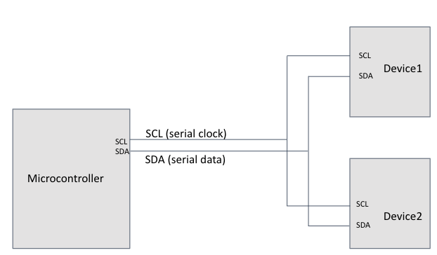
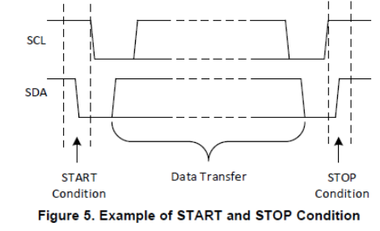
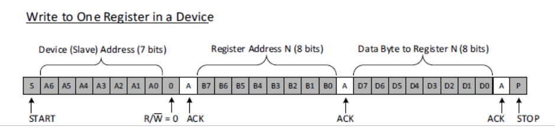
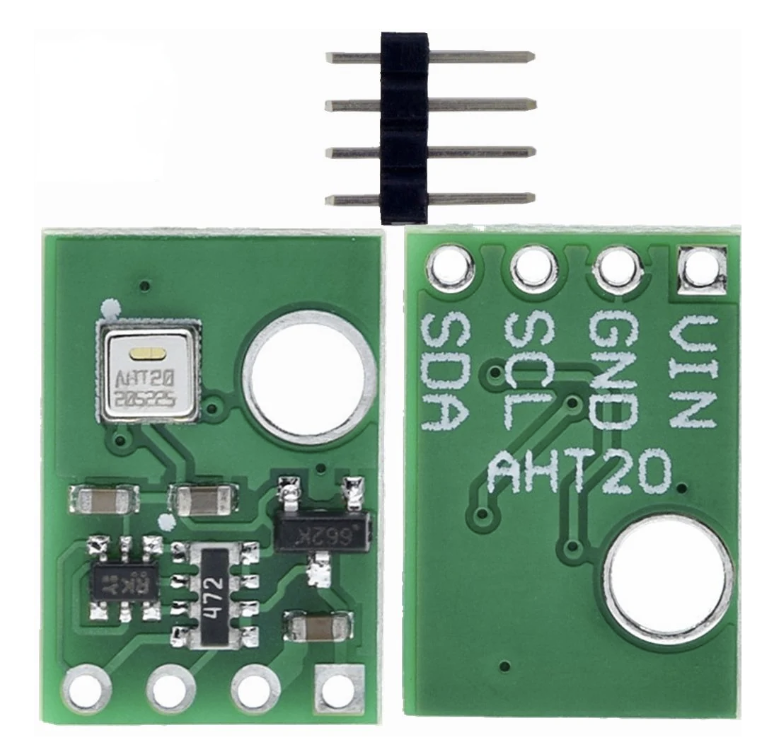
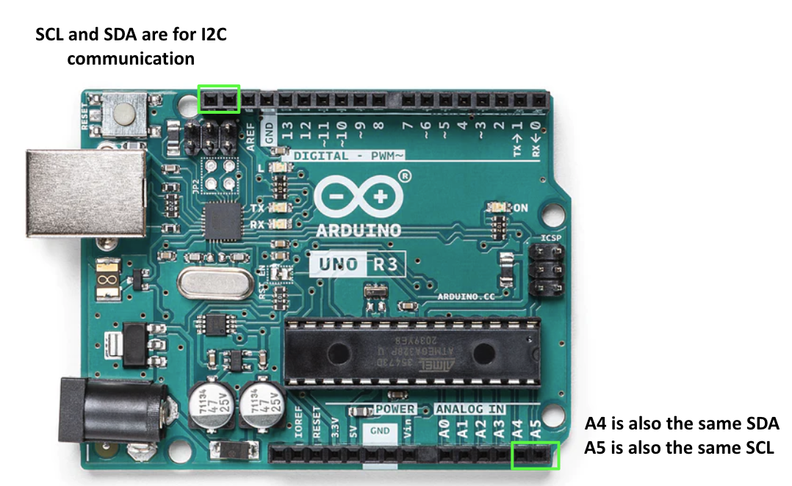
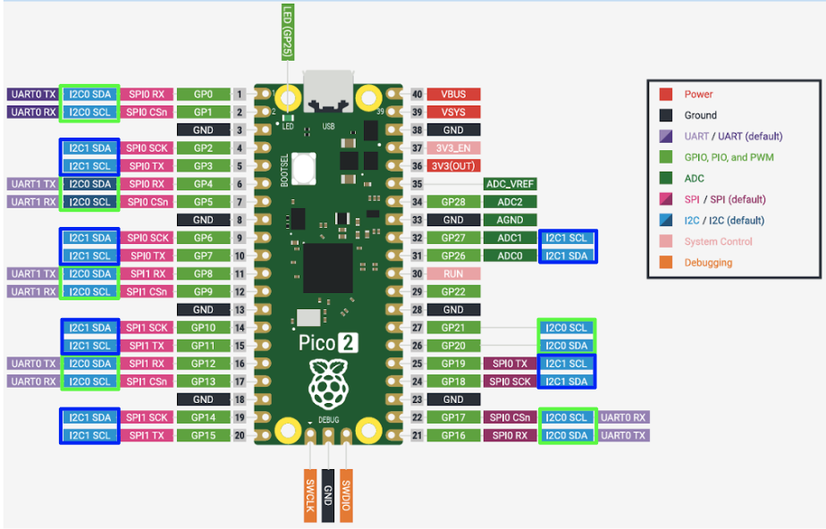
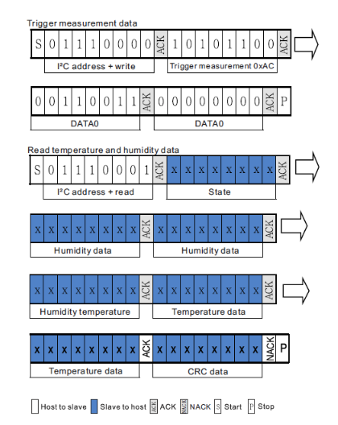
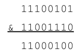
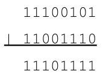

# Day 11 - I2C

The focus for Day X is to **get comfortable with the I2C communication protocol** by interfacing with the AHT20 (humidity and temperature detector).

## I2C Concept
- when sensors and chips output info through a digital signal, one can observe this data through I2C or SPI
- **I2C (Inter-Integrated Circuit)** also known as TWI (two wire interface) due to it only using two wires allows multiple devices to share the clock and data line
    - **clock line (SCL)** synchronizes info sent and received btw devices on SDA
    - **data line (SDA)** is where data is passed to and from the controller and device
    - multiple devices share the two lines, using e/ device's unique address the microcontroller knows who to talk to
    - sometimes these lines need to be **pulled up**
    - 
- at the start SCL and SDA are high, when SDA is low this signals the start
    - the address then a read (1) or write(0) bit is sent indicating whether the device is sending or receiving
    - 
    - 
- often an address can be configurable so you can use multiple of the same IC, such as the MCP980 which has 3 pins that can be pulled high or low

## AHT20 IC
- the **AHT20** is a temperature and humidity sensor w/ an address of `0x38`
    - often a device will have multiple functions, with aspects located at different memory locations (registers)
    - need to write register location + whether you are reading or writing
        - ex: to read from register 47, w/ device at 0x38 (0b0111000)
            1) MC Send on SDA: `01110000` (add 0 for write)
            2) MC Send on SDA: `00101111` (47 sets device to address)
            3) MC Send on SDA: `01110001  (add 1 for read) > now can read from SDA
    -   \
- Below are the locations for I2C pins for both the uno and the pico 2
    - 
    - 
- most microcontrollers have libraries written to operate I2C clock and send/receive, Arduino has Wire.h
    - to setup use `#include<Wire.h>` and `Wire.begin()`
    - to set specific wires to pins you can do `Wire.setSDA(pin)` and `Wire.setSCL(pin)`, and you can also use Wire1 instead
    - `Wire.endTransmission();` returns a 0 upon success
```cpp
// example I2C write
Wire.beginTransmission(deviceAddress);
Wire.write(someByte);
Wire.write(someByte);   //repeat until you are done writing
Wire.endTransmission();
```
```cpp
// example I2C read
Wire.beginTransmission(deviceAddress);
Wire.write(someByte); //register address you want to read from
Wire.endTransmission();

Wire.requestFrom(deviceAddress,numberofbytes);
if (numberofbytes <= Wire.available()) {
byteWeRead = Wire.read();
secondByteWeRead = Wire.read();  //this example assumes numberofbytes = 2
}
```
```cpp
// combined read + write to read from client
Wire.beginTransmission(0x38);
Wire.write(0x29); //register address you want to read from
Wire.endTransmission();
Wire.requestFrom(0x38,2);
if (2 <= Wire.available()) {
byteWeRead = Wire.read();
secondByteWeRead = Wire.read();  //for 2 bytes
}
```
- the example I2C Scanner can be used to debug, as it outputs all addresses connected via SDA and SCL
    - setup the AHT20 on the RP2350 and check that it has the address on I2C Scanner
- to read data from the AHT20, we need to follow the [data sheet](https://cdn-learn.adafruit.com/downloads/pdf/adafruit-aht20.pdf)

## Parsing Data
- we need to use bit manipulation due to the organization of the data
    -
- To adjust information, we can use bitmasking 
    - with the bitwise AND operator `$`
        - the bitwise and operator works bit by bit, making the AND comparison between each respective bit
        - 
    - with the bitwise OR operator `|`
        - the bitwise or operator also works bit by bit, doing a respective OR comparison
        - 
- after combining the bits the temperature and humidty need to be transformed using the following formulas (S = Signal Input)
    - Humidity: `RH[%] = (S/(2^20))*100`
    - Temperature `T(C) = (S/(2^20))*200 - 50`
### Practice
1) ([Answer](./Answers/ReadHumidTemp.ino)) Plot Temp and Humidity - Make a program to print the temperature and humidity values to Serial. Make sure that the numbers make sense (room temp is about 22-25C; the humidity should increase if you breathe heavily on the sensor)
2) ([Answer]()) OLED Display - Add your OLED display and program it to display the RH% and Temperature data on the screen

## Additional Reading
- NOTES: [Altium - I2C vs SPI](https://resources.altium.com/p/spi-versus-i2c-how-choose-best-protocol-your-memory-chips)
- NOTES: [TI - Basic Guide to I2C](https://www.ti.com/lit/an/sbaa565/sbaa565.pdf?ts=1767896422425&ref_url=https%253A%252F%252Fkagi.com%252F)
- PRACTICE: [IEEE @ UCI - AHT20 Weather Station](https://ieee.ics.uci.edu/ops/project_6.html)

**[Continue to next lesson](../D12:I2S%20Input/D12.md)**